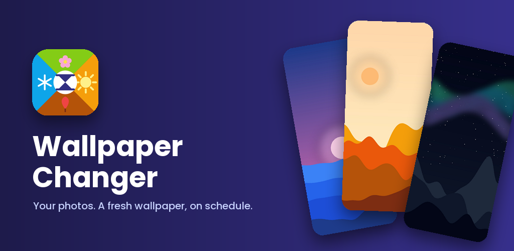
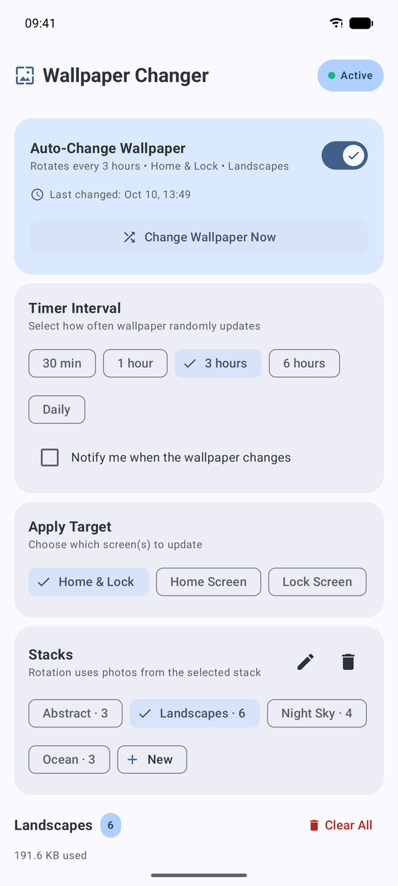
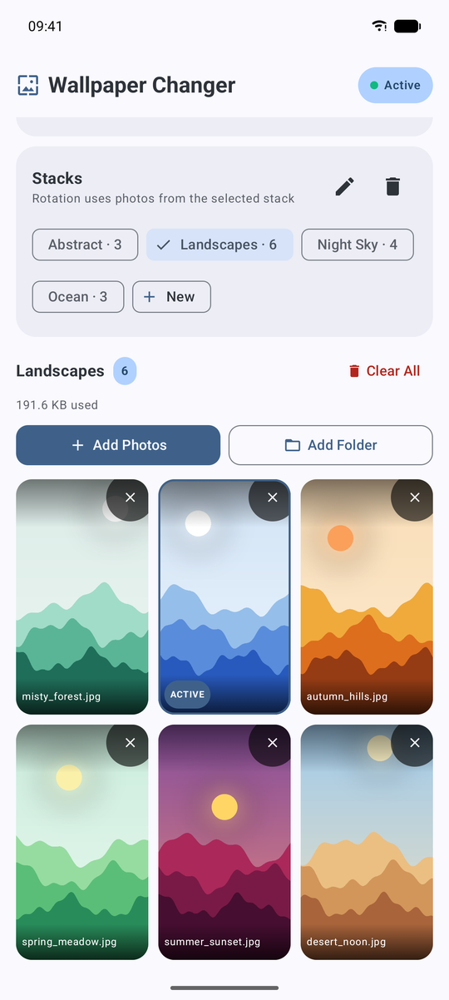
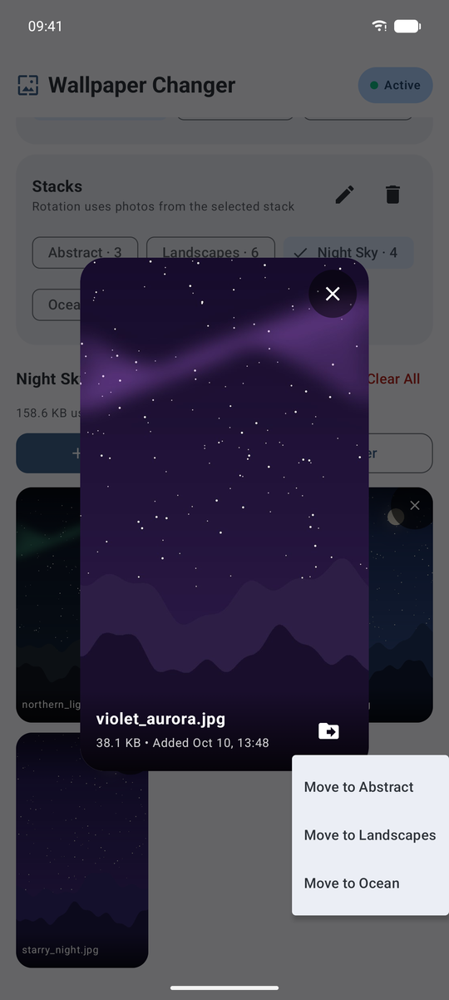
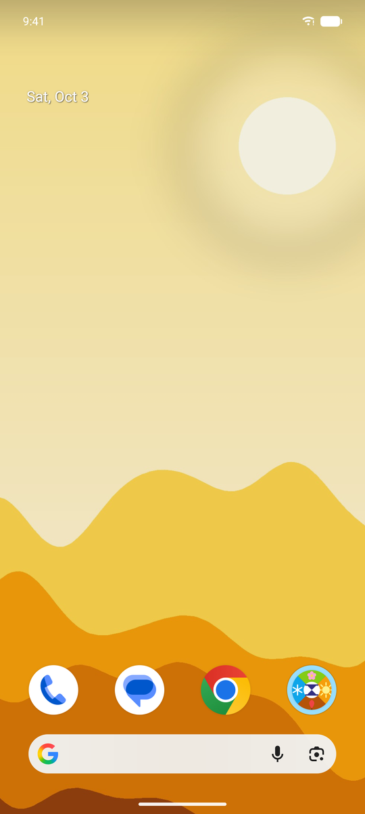
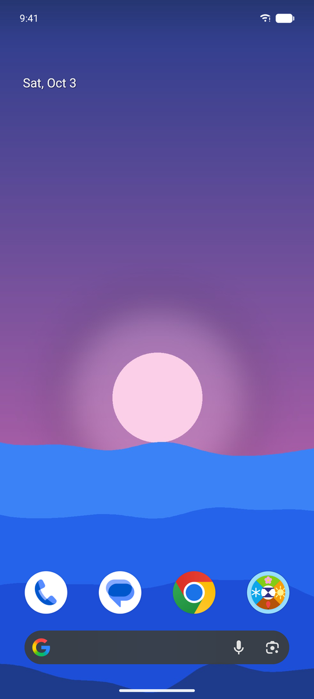
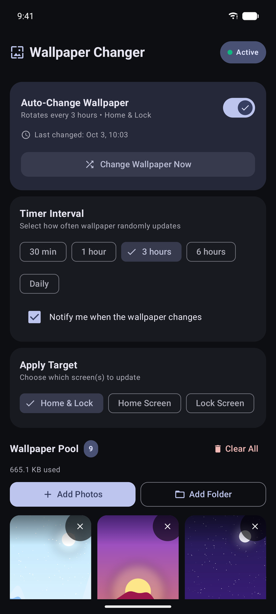
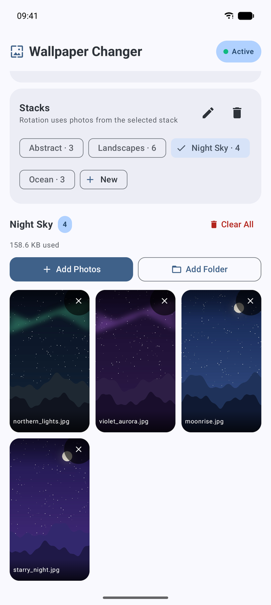
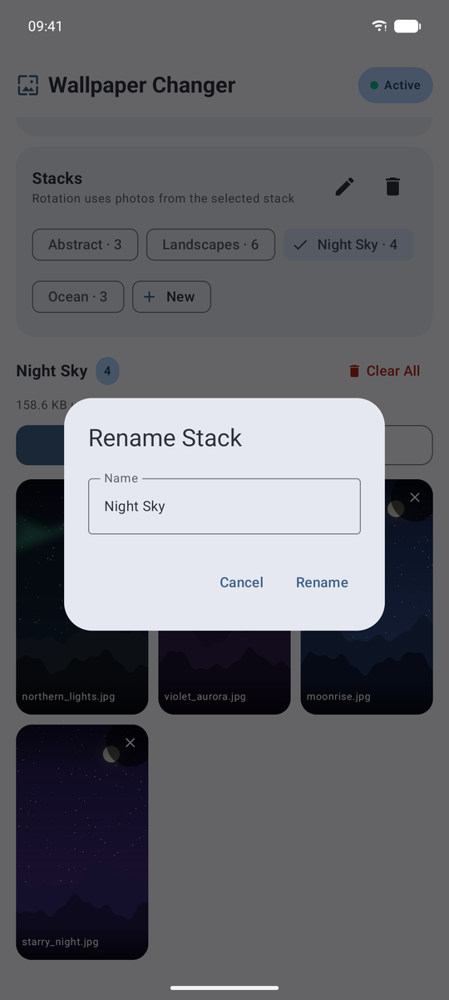
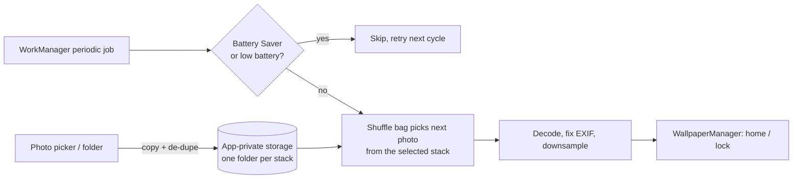

<p align="center">
  
</p>

<p align="center">
  <b>Your photos. A fresh wallpaper, on schedule.</b><br>
  A small, private, battery-friendly Android app that rotates your own photos as your wallpaper.
</p>

<p align="center">
  <a href="https://github.com/gcg/wpchanger/actions/workflows/ci.yml"></a>
  
  
  
</p>

---

## Screenshots

| Set it & forget it | Your stacks | Preview & move | On your home screen |
| :---: | :---: | :---: | :---: |
|  |  |  |  |

With Material You, the app re-themes itself to match the wallpaper it just set:

| New wallpaper | App in dark mode |
| :---: | :---: |
|  |  |

## Features

- 🖼️ **Photos or whole folders**: system photo picker, or import an entire album
- ⏱️ **Intervals**: 30 min · 1 h · 3 h · 6 h · daily
- 📱 **Targets**: home screen, lock screen, or both
- 🗂️ **Stacks**: group photos (wallpapers, landscapes, friends…), rename them, move photos between them, and pick which one rotates
- 🔀 **Shuffle bag**: every photo gets a turn before any repeats
- 🔋 **Battery-friendly**: pauses in Battery Saver and on low battery, resumes on its own
- 🔔 **Optional notification** with a preview of the new wallpaper
- 🔒 **Private**: no internet permission, no accounts, no ads, no analytics

## Stacks

Keep separate sets of photos, say *Wallpapers*, *Landscapes* and *Friends*, and choose which one rotates.

- **Switch**: tap a stack's chip. The grid below shows that stack, and rotation draws only from it.
- **Create / rename / delete**: the **New** chip, ✏️ and 🗑 on the Stacks card. Deleting a stack removes its photos from the app (your gallery originals are untouched).
- **Move a photo**: tap it to open the preview, then use the move button to send it to another stack.
- **Upgrading from an older version?** Your existing photos are moved into a **My Photos** stack automatically, nothing to re-import.

| Switch stacks | Rename a stack |
| :---: | :---: |
|  |  |

## Example setups

| Goal | Interval | Target |
| :--- | :--- | :--- |
| A new holiday photo every morning | Daily | Home & Lock |
| Keep the lock screen surprising, the home screen calm | 1 hour | Lock Screen |
| Slow-cycle a seasonal art folder | 6 hours | Home Screen |
| Get through a big album quickly | 30 min | Home & Lock |
| Friends this week, landscapes next: just tap another stack | 3 hours | Home & Lock |

## How it works



Photos are copied into `filesDir/wallpapers/<stack name>/` so rotation never breaks when the original moves or a URI permission expires. Each stack is just a folder, so renaming a stack is a folder rename. Settings, including the selected stack, live in DataStore.

## Build & run

Requires JDK 21 and the Android SDK.

```bash
make run-device   # build + install on a USB/wireless-connected phone
make run          # same, on an emulator (boots one if needed)
make check        # format + lint + unit tests (run before every PR)
make bundle       # signed release .aab for Google Play
make help         # everything else
```

## Project layout

```
app/src/main/java/com/gcg/wpchanger/
├── data/     # repository, stacks, DataStore prefs, shuffle bag, WallpaperManager helper
├── ui/       # Compose screen + ViewModel, Material 3 theme
└── worker/   # WorkManager job, scheduler, notifications
fastlane/metadata/android/   # Play Store listing text + graphics
```

## Tech

Kotlin · Jetpack Compose (Material 3) · WorkManager · DataStore · Coil · targetSdk 36, minSdk 34

## Privacy

Nothing leaves your phone. See the [privacy policy](PRIVACY.md).

## Publishing

Release steps live in [docs/PLAY_STORE.md](docs/PLAY_STORE.md).
